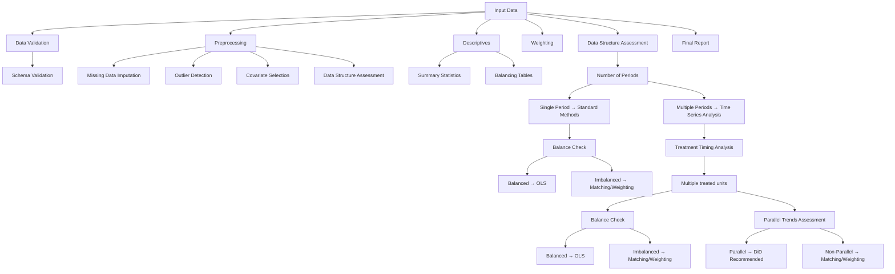

# Descriptive Analysis Graph Requirements

## Overview
The descriptive analysis graph serves as a precursor to causal inference methods, providing essential data exploration and validation steps within the PyAutoCausal framework.

## Purpose
1. Perform systematic exploratory data analysis (EDA) prior to causal modeling
2. Validate assumptions required for causal inference methods
3. Identify potential data quality issues or confounding factors
4. Guide method selection based on data characteristics

## Data Schema Requirements

### Input Requirements
- Dataset file formats: csv, parquet, dataframe
- Required columns:
  - Outcome variable(s): prefix 'y', 'y_1', 'y_2', etc.
  - Unit identifier: 'id_unit'
  - Time variable: 'period'
  - Treatment variable(s): prefix 'treat', 'treat_1', 'treat_2', etc.
    - Binary treatment: coded as 0/1
    - Continuous treatment: more than two values
    - Other formats: return error

- Optional columns:
  - Covariates/controls: prefix 'x', 'x_1', 'x_2', etc.
    - Continuous covariates: prefix 'x_cont', 'x_cont_1', etc.
    - Categorical covariates: prefix 'x_cat', 'x_cat_1', etc.
  - Treatment timing: 'treat_time'
  - Additional unit-level identifiers: prefix 'id_', 'id_county', etc.

### Data Quality Requirements
- Missing values: explicitly marked as NaN
- Duplicates: removed or explicitly handled
- Variable types: appropriate (e.g., dates as datetime)

## Primary Decision Points
1. Data type (cross-sectional vs. panel/longitudinal)
2. Treatment structure (binary, multi-valued, continuous)
3. Time structure (single period vs. multiple periods)
4. Missing data patterns (MCAR, MAR, MNAR)
5. Covariate balance between treatment groups
6. Sample size adequacy for statistical power

## Graph Flow

## Node Overview

### Descriptive Table Nodes
- Summary Statistics Table Node
- Missing Data Table Node
- Outlier Table Node
- Balancing Table Node

### Weighting Nodes
- Propensity Score Matching Node
- Synthetic Control Weighting Node

### Model Nodes
- OLS Node with option for weighted OLS
- DSLasso Node
- DiD Node
- Event Study Node

### Output Nodes
- OLS Output Node
- DiD Output Node
- Event Study Output Node

### Plotting Nodes
- Event Study Plot Node
- Balance Check Plot Node

## Node Requirements

### Input Requirements

### Output Requirements 