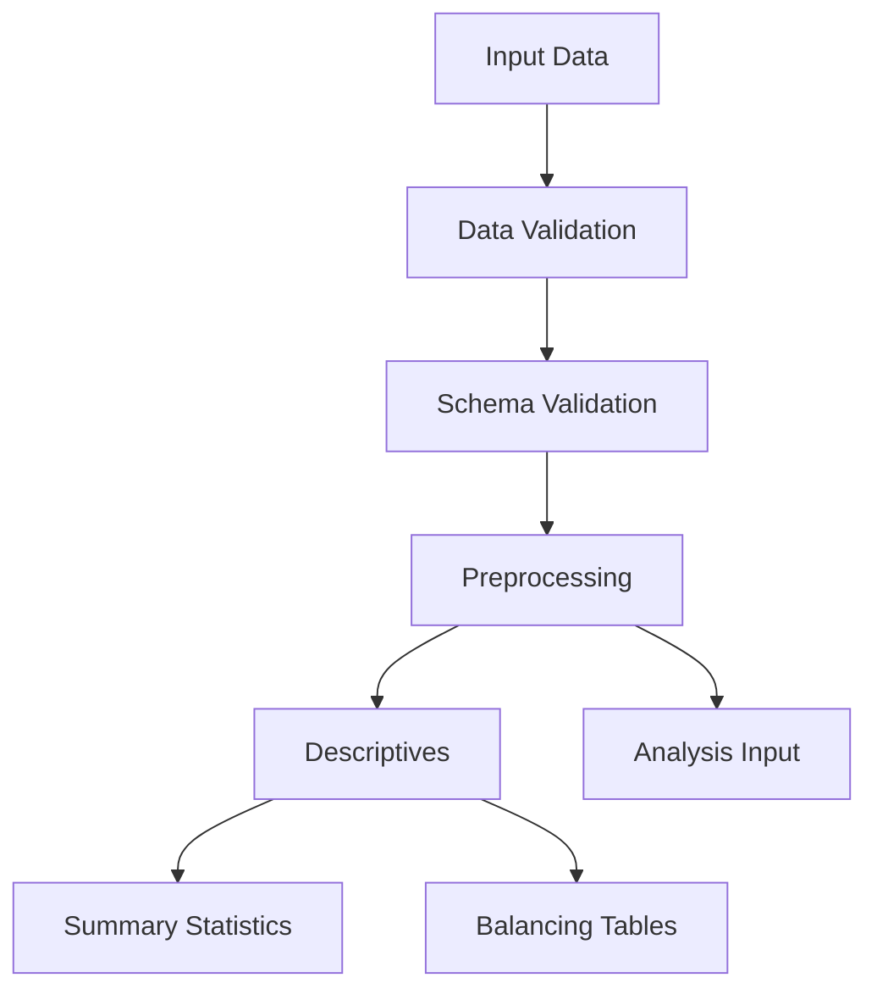
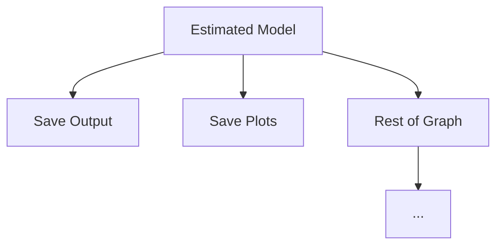

# Descriptive Analysis Graph Requirements

## Overview
The descriptive analysis graph serves as a precursor to causal inference methods, providing essential data exploration and validation steps within the PyAutoCausal framework.

## Purpose
1. Perform systematic exploratory data analysis (EDA) prior to causal modeling
2. Validate assumptions required for causal inference methods
3. Identify potential data quality issues or confounding factors
4. Guide method selection based on data characteristics

## Data Schema Requirements

### Input Requirements
- Dataset file formats: csv, parquet, dataframe
- Required columns:
  - Outcome variable(s): prefix 'y', 'y_1', 'y_2', etc.
  - Unit identifier: 'id_unit'
  - Time variable: 'period'
  - Treatment variable(s): prefix 'treat', 'treat_1', 'treat_2', etc.
    - Binary treatment: coded as 0/1
    - Continuous treatment: more than two values
    - Other formats: return error

- Optional columns:
  - Covariates/controls: prefix 'x', 'x_1', 'x_2', etc.
    - Continuous covariates: prefix 'x_cont', 'x_cont_1', etc.
    - Categorical covariates: prefix 'x_cat', 'x_cat_1', etc.
  - Treatment timing: 'treat_time'
  - Additional unit-level identifiers: prefix 'id_', 'id_county', etc.

### Data Quality Requirements
- Missing values: explicitly marked as NaN
- Duplicates: removed or explicitly handled
- Variable types: appropriate (e.g., dates as datetime)

## Primary Decision Points
1. Data type (cross-sectional vs. panel/longitudinal)
2. Treatment structure (binary, multi-valued, continuous)
3. Time structure (single period vs. multiple periods)
4. Missing data patterns (MCAR, MAR, MNAR)
5. Covariate balance between treatment groups
6. Sample size adequacy for statistical power

## Graph Flow

This initial graph shows the basic data flow from input through validation, preprocessing, and descriptive analysis before entering the main analysis pipeline. It ensures data quality and prepares the dataset for causal analysis.



## Analysis Graph Flow

This decision tree guides the selection of appropriate causal inference methodologies based on data structure, treatment patterns, and time periods. It helps determine whether standard approaches, difference-in-differences, or synthetic control methods are most appropriate for the dataset.

Possible specifications are:
- Standard Specification
- Difference-in-Differences (DiD) Specification
- Staggered DiD
- Santana DiD Specification


```mermaid
graph TD
    E[Analysis Input] --> F[Analysis]
    F --> F1[Check Multiple Periods]
    
    F1 -->|"No"| F3[Check Balance]
    F3 -->|"Balanced"| F4[Stand. Specif.]
     
    F1 -->|"Yes"| F7[Check Treated Units]
    F7 -->|"Equal 1"| F8[Stand. Specif]
    F7 -->|"More than 1"| F10[Check Pre-periods]
    
    F10 -->|"Only 1"| F13[Check Treatment Timing]
    F10 -->|"More than 1"| F12[Test Parallel Trends]
    
    F12 --> F13[Check Treatment Timing]
    
    F13 -->|"Simultaneous"| F15[DiD Specif]
    F13 -->|"Staggered"| F16[Staggered DiD]
    F16 --> F17[DiD Spefic]
    F16 --> F18[Santana DiD Specif]
  ```

## Post-Specification Analysis Flow

After selecting a specification, the model refinements determines whether standard OLS models, weighted approaches, or high-dimensional methods like Double Selection Lasso are most appropriate.

```mermaid
graph TD
    S[Selected Specification] --> C1[Number of covariates]
    S[Selected Specification] --> S1[Number of treated units]

      C1 --> |"High Dim"| C2["DS Lasso"]
    
    C1 --> |"Low Dim"| B1[Check Balance]
    
    B1 -->|"Well Balanced"| M1[Standard OLS]
    B1 -->|"Imbalanced"| W1[Apply weighting]
    S1 -->|"One"| W1

    W1 --> M1[Standard OLS]
    W1 --> P1[Weighted OLS]
```

## Post-Estimation Analysis Flow

Results and visualizations are saved while the model is passed to any downstream components in the broader analysis pipeline.



## Node Overview

### Data Processing Nodes
- Input Data Node
- Data Validation Node
- Schema Validation Node
- Preprocessing Node
- Analysis Input Node

### Descriptive Analysis Nodes
- Summary Statistics Table Node
- Balancing Tables Node
- Missing Data Table Node
- Outlier Table Node

### Analysis Decision Nodes
- Multiple Periods Check Node
- Balance Check Node
- Treated Units Check Node
- Pre-periods Check Node
- Parallel Trends Test Node
- Treatment Timing Check Node
- Covariates Count Check Node

### Specification Nodes
- Standard Specification Node
- DiD Specification Node
- Staggered DiD Specification Node
- Synthetic Control Specification Node

### Modeling Nodes
- Standard OLS Node
- Weighted OLS Node
- Double Selection Lasso Node
- Propensity Score Matching Node
- DiD Node
- Event Study Node

### Weighting Nodes
- Propensity Score Matching Node
- Synthetic Control Weighting Node

### Output Nodes
- Results Generation Node
- Coefficient Table Node
- Effect Plots Node
- Diagnostic Tests Node
- Model Output Node
- Plot Output Node

### Post-Estimation Nodes
These nodes will have to be model specific
- Save Output Node
- Save Plots Node

## Node Requirements


