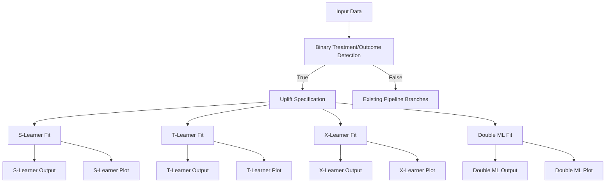

# Uplift Modeling Feature Design Document

## 1. Overview

### 1.1 Motivation
The PyAutoCausal framework currently focuses on panel data methods (DiD, synthetic control, event studies) but lacks support for cross-sectional uplift modeling - a critical technique for measuring treatment effects in randomized experiments, particularly in digital marketing and A/B testing contexts.

**Important**: This feature strictly adheres to PyAutoCausal's established data schema conventions, requiring standard column names (`y` for outcome, `treat` for treatment, `id_unit` for unit identifier) and leveraging existing data validation utilities.

The Criteo dataset represents a common use case: large-scale randomized controlled trial data with binary treatment assignment, binary outcomes, and rich feature sets. Adding uplift modeling capabilities will enable:

- **Heterogeneous Treatment Effect (HTE) estimation**: Identifying which user segments benefit most from treatment
- **Average Treatment Effect (ATE) estimation**: Robust causal inference for binary outcomes
- **Uplift optimization**: Targeting decisions based on predicted individual treatment effects
- **Model comparison**: Benchmarking multiple uplift approaches automatically

### 1.2 Scope
This feature adds a new branch to the existing causal pipeline that:
- Automatically detects binary treatment/outcome scenarios
- Implements multiple uplift modeling approaches (S-learner, T-learner, X-learner, Double ML)
- Provides comprehensive diagnostics and visualizations
- Integrates seamlessly with existing pipeline infrastructure
- Supports both conversion and visit outcomes for the Criteo dataset

## 2. Architecture Integration

### 2.1 Pipeline Flow


### 2.2 Component Integration
The uplift modeling branch integrates with existing PyAutoCausal infrastructure:

- **Specifications**: New `UpliftSpec` class following existing patterns
- **Estimators**: Uplift fitting functions using `@make_transformable` decorator
- **Conditions**: Decision logic for automatic routing
- **Output**: Standardized reporting and visualization
- **Orchestration**: Seamless integration with `ExecutableGraph`

### 2.3 Alignment with PyAutoCausal Conventions
The uplift modeling feature strictly follows established data schema conventions:

| Convention | Panel Data Methods | Uplift Modeling |
|------------|-------------------|-----------------|
| Outcome Column | `y`, `y_1`, `y_2` | `y` (binary) |
| Treatment Column | `['treat']` (list) | `['treat']` (list) |
| Unit Identifier | `id_unit` | `id_unit` |
| Time Variable | `t` | N/A (cross-sectional) |
| Control Variables | Auto-detected numeric | Auto-detected numeric |
| Data Validation | `validate_and_prepare_data()` | Same function reused |
| Specification Pattern | `create_*_specification()` | `create_uplift_specification()` |

This ensures:
- **Consistency**: Users familiar with panel methods can easily use uplift modeling
- **Reusability**: Leverages existing validation and data preparation utilities
- **Maintainability**: Follows established patterns for easier code maintenance

## 3. Technical Specifications

### 3.1 Data Requirements
**Input Data Schema (Following PyAutoCausal Conventions):**

| Column Type | Naming Convention | Description |
|-------------|-------------------|-------------|
| Outcome Variable | `y` | Binary outcome (0/1) for uplift modeling |
| Treatment Variable | `treat` | Binary treatment indicator (0/1) |
| Unit Identifier | `id_unit` | Unique identifier for each observation |
| Control Variables | Auto-detected | All numeric columns except outcome, treatment, and ID |

**Criteo Dataset Column Mapping:**
To use the Criteo dataset with PyAutoCausal conventions, rename columns as follows:
```python
# Required transformations for Criteo data
df_criteo = df_criteo.rename(columns={
    'treatment': 'treat',      # Align with PyAutoCausal convention
    'conversion': 'y',         # Primary outcome
    # 'visit': 'y',            # Alternative: use visit as outcome
})
df_criteo['id_unit'] = df_criteo.index  # Add unit identifier

# Features f0-f11 will be automatically detected as control variables
# No need to explicitly specify them - follows existing pattern
```

**Auto-detection Logic:**
- **Control/Feature columns**: Automatically detected as all numeric columns excluding:
  - Outcome column (`y`)
  - Treatment column (`treat`)
  - Unit identifier (`id_unit`)
  - Time column (`t`) if present
- This matches the existing `validate_and_prepare_data` function behavior

### 3.2 Model Specifications

#### 3.2.1 S-Learner (Single Model)
**Approach**: Single model predicting outcome from features + treatment indicator
```python
y = f(X, T) where T ∈ {0,1}
τ(X) = f(X, T=1) - f(X, T=0)
```

**Implementation**:
- Base learner: Gradient Boosting Classifier
- Cross-validation for hyperparameter tuning
- CATE estimation via prediction difference

#### 3.2.2 T-Learner (Two Models)
**Approach**: Separate models for treatment and control groups
```python
μ₁(X) = E[Y|T=1, X]  # Treated outcome model
μ₀(X) = E[Y|T=0, X]  # Control outcome model  
τ(X) = μ₁(X) - μ₀(X)
```

**Implementation**:
- Base learner: Random Forest Classifier
- Separate model training on treatment/control subsets
- CATE estimation via model difference

#### 3.2.3 X-Learner (Cross-Validation Enhanced)
**Approach**: Two-stage estimation with cross-fitted imputation
```python
Stage 1: Fit μ₁(X), μ₀(X) as in T-learner
Stage 2: Impute treatment effects and fit models on pseudo-outcomes
```

**Implementation**:
- Propensity score weighting for combination
- Cross-fitting to reduce overfitting bias
- Optimal for moderate treatment overlap scenarios

#### 3.2.4 Double ML for Binary Outcomes
**Approach**: Doubly robust estimation with cross-fitting
```python
ψ(Y,T,X;η) = (T - m(X))/e(X) * (Y - μ(X)) + μ₁(X) - μ₀(X)
```

**Implementation**:
- Nuisance parameter estimation: Random Forest
- Cross-fitting with 5 folds, 2 repetitions
- Debiased moment conditions for ATE estimation

### 3.3 Output Specifications

#### 3.3.1 Treatment Effect Estimates
```python
{
    'ate_estimate': float,           # Average treatment effect
    'ate_ci': Tuple[float, float],   # 95% confidence interval
    'cate_estimates': Dict[str, np.ndarray],  # Individual treatment effects
    'cate_statistics': Dict[str, float],      # CATE distribution stats
    'model_performance': Dict[str, float]     # Cross-validation metrics
}
```

#### 3.3.2 Visualization Outputs
- **Uplift Curves**: Treatment effect by predicted uplift deciles
- **CATE Distributions**: Histograms of individual treatment effects
- **Gain Charts**: Cumulative gain from targeting high-uplift individuals
- **Calibration Plots**: Predicted vs. observed treatment effects
- **Feature Importance**: Most predictive features for heterogeneity

**Important**: All plot functions include validation:
```python
if spec.cate_estimates is None or spec.ate_estimate is None:
    raise ValueError("No uplift estimates found. Ensure model is fitted.")
```

## 4. Implementation Details

### 4.1 New Components

#### 4.1.1 Specification Class
```python
@dataclass
class UpliftSpec(BaseSpec):
    """Uplift modeling specification for binary treatment and outcomes."""
    outcome_col: str
    treatment_cols: List[str]  # List to match existing pattern
    control_cols: List[str]    # Renamed from feature_cols to match convention
    unit_col: str              # Added to match existing specs
    model: Optional[Any] = None  # IMPORTANT: Required for compatibility with existing pipeline
    propensity_score: Optional[np.ndarray] = None
    cate_estimates: Optional[Dict[str, np.ndarray]] = None
    ate_estimate: Optional[float] = None
    ate_ci: Optional[Tuple[float, float]] = None
    model_type: Optional[str] = None
    models: Optional[Dict[str, Any]] = None
    evaluation_metrics: Optional[Dict[str, float]] = None
```


#### 4.1.3 Specification Creation Function
```python
@make_transformable
def create_uplift_specification(
    data: pd.DataFrame,
    outcome_col: str = 'y',
    treatment_cols: List[str] = ['treat'],
    unit_col: str = 'id_unit',
    control_cols: Optional[List[str]] = None
) -> UpliftSpec:
    """
    Create uplift modeling specification following PyAutoCausal patterns.
    
    Uses validate_and_prepare_data to handle control column auto-detection
    and data validation, matching existing specification functions.
    """
    # Validate and prepare data using existing utility
    data, control_cols = validate_and_prepare_data(
        data=data,
        outcome_col=outcome_col,
        treatment_cols=treatment_cols,
        control_cols=control_cols,
        excluded_cols=[unit_col]  # Exclude ID from controls
    )
    
    # Additional validation for uplift modeling
    treatment_col = treatment_cols[0]  # Use first treatment
    if data[outcome_col].nunique() != 2:
        raise ValueError(f"Outcome {outcome_col} must be binary for uplift modeling")
    if data[treatment_col].nunique() != 2:
        raise ValueError(f"Treatment {treatment_col} must be binary for uplift modeling")
    
    formula = f"{outcome_col} ~ {treatment_col} + " + " + ".join(control_cols)
    
    return UpliftSpec(
        data=data,
        formula=formula,
        outcome_col=outcome_col,
        treatment_cols=treatment_cols,
        control_cols=control_cols,
        unit_col=unit_col
    )
```

#### 4.1.4 Estimator Functions
```python
@make_transformable
def fit_s_learner(spec: UpliftSpec) -> UpliftSpec:
    """
    Fit single model for uplift estimation.
    IMPORTANT: Modifies spec in-place and returns it (following existing pattern).
    """
    # Extract data using standard column access
    X = spec.data[spec.control_cols]
    y = spec.data[spec.outcome_col]
    t = spec.data[spec.treatment_cols[0]]  # Use first treatment column
    
    # ... fitting logic ...
    
    # Store results in spec (modify in-place)
    spec.model_type = 's-learner'
    spec.models = {'s_model': fitted_model}
    spec.cate_estimates = {'s_learner': cate_array}
    spec.ate_estimate = ate_value
    spec.ate_ci = (lower, upper)
    spec.model = fitted_model  # For compatibility with output functions
    
    return spec  # Return modified spec
    
@make_transformable  
def fit_t_learner(spec: UpliftSpec) -> UpliftSpec:
    """
    Fit separate models for treatment and control groups.
    Modifies spec in-place following existing patterns.
    """
    # Similar pattern - modify and return input spec
    
@make_transformable
def fit_x_learner(spec: UpliftSpec) -> UpliftSpec:
    """
    Fit cross-validated enhanced T-learner.
    Modifies spec in-place following existing patterns.
    """
    # Similar pattern - modify and return input spec
    
@make_transformable
def fit_double_ml_binary(spec: UpliftSpec) -> UpliftSpec:
    """
    Fit Double ML for binary outcomes.
    Modifies spec in-place following existing patterns.
    """
    # Similar pattern - modify and return input spec
```

### 4.2 Integration Points

#### 4.2.1 Graph Construction
New branch creation in `example_graph.py`:
```python
def _create_uplift_branch(graph: ExecutableGraph, abs_text_dir: Path, abs_plots_dir: Path):
    """Create parallel uplift modeling nodes following existing patterns."""
    
    # Decision routing
    graph.create_decision_node(
        'binary_treatment_outcome',
        condition=has_binary_treatment_and_outcome,
        predecessors=["df"]
    )
    
    # Uplift specification (single shared input)
    graph.create_node(
        'uplift_spec',
        action_function=create_uplift_specification.transform({'df': 'data'}),
        predecessors=["binary_treatment_outcome"]
    )
    
    # Independent parallel model fitting (each method runs separately)
    # S-Learner branch
    graph.create_node(
        's_learner_fit',
        action_function=fit_s_learner.transform({'uplift_spec': 'spec'}),
        predecessors=["uplift_spec"]
    )
    graph.create_node(
        's_learner_output',
        action_function=write_uplift_summary.transform({'s_learner_fit': 'spec'}),
        output_config=OutputConfig(abs_text_dir / 's_learner_results', OutputType.TEXT),
        save_node=True,  # IMPORTANT: Required for saving outputs
        predecessors=["s_learner_fit"]
    )
    graph.create_node(
        's_learner_plot',
        action_function=uplift_curve_plot.transform({'s_learner_fit': 'spec'}),
        output_config=OutputConfig(abs_plots_dir / 's_learner_curve', OutputType.PNG),
        save_node=True,  # IMPORTANT: Required for saving plots
        predecessors=["s_learner_fit"]
    )
    
    # T-Learner branch (independent of S-Learner)
    graph.create_node(
        't_learner_fit',
        action_function=fit_t_learner.transform({'uplift_spec': 'spec'}),
        predecessors=["uplift_spec"]
    )
    # ... similar output and plot nodes for T-Learner
    
    # X-Learner and Double ML branches follow same independent pattern
```

#### 4.2.2 Decision Routing
```python
def _configure_uplift_paths(graph: ExecutableGraph):
    """Configure decision paths for uplift branch."""
    graph.when_true("binary_treatment_outcome", "uplift_spec")
    graph.when_false("binary_treatment_outcome", "multi_period")  # Existing pipeline
```

## 5. Usage Examples

### 5.1 Criteo Dataset Example
```python
import pandas as pd
from pyautocausal.pipelines.example_graph import causal_pipeline
from pathlib import Path

# Load Criteo data
df = pd.read_parquet("pyautocausal/examples/data/criteo_sample.parquet")

# Transform to PyAutoCausal conventions
df = df.rename(columns={
    'treatment': 'treat',      # Standard treatment column name
    'conversion': 'y'          # Standard outcome column name
})
df['id_unit'] = df.index      # Add unit identifier

# Execute pipeline - automatically routes to uplift branch
output_path = Path('outputs/criteo_uplift')
graph = causal_pipeline(output_path)
graph.fit(df=df)

# Results available in:
# - outputs/criteo_uplift/text/{method}_results.txt
# - outputs/criteo_uplift/plots/{method}_uplift_curve.png  
# - outputs/criteo_uplift/notebooks/criteo_sample.html
```

### 5.2 Custom Uplift Analysis
```python
from pyautocausal.pipelines.library.specifications import create_uplift_specification
from pyautocausal.pipelines.library.estimators import fit_t_learner
from pyautocausal.pipelines.library.plots import uplift_curve_plot

# Prepare data following conventions
df_prepared = df.rename(columns={
    'treatment': 'treat',
    'conversion': 'y'
})
df_prepared['id_unit'] = df_prepared.index

# Manual specification creation
# Control columns (f0-f11) will be auto-detected
spec = create_uplift_specification(
    data=df_prepared,
    outcome_col='y',              # Standard outcome name
    treatment_cols=['treat'],     # List format as per convention
    unit_col='id_unit',          # Standard unit identifier
    control_cols=None            # Auto-detect numeric columns
)

# Fit specific method
spec_fitted = fit_t_learner(spec)

# Generate visualizations  
fig = uplift_curve_plot(spec_fitted)
```

## 6. Performance Considerations

### 6.1 Scalability
- **Memory Efficiency**: Sparse matrix support for high-dimensional features
- **Parallel Processing**: Concurrent model fitting across methods
- **Incremental Learning**: Support for streaming data updates
- **GPU Acceleration**: Optional GPU-based model training

### 6.2 Computational Complexity
- **S-Learner**: O(n * log(n)) - single model training
- **T-Learner**: O(n * log(n)) - two parallel models  
- **X-Learner**: O(k * n * log(n)) - k-fold cross-fitting
- **Double ML**: O(k * r * n * log(n)) - k folds, r repetitions

### 6.3 Optimization Strategies
- **Early Stopping**: Prevent overfitting in ensemble methods
- **Feature Selection**: Automated feature importance thresholding
- **Hyperparameter Tuning**: Bayesian optimization for model selection
- **Caching**: Intermediate result storage for iterative analysis

## 7. Validation & Testing

### 7.1 Unit Tests
```python
# Test specification creation
def test_uplift_specification_creation():
    """Test automatic feature detection and validation."""
    
# Test model fitting
def test_model_fitting_methods():
    """Test all uplift estimation methods."""
    
# Test output generation  
def test_output_generation():
    """Test text and plot output creation."""
```

### 7.2 Integration Tests
```python
# Test pipeline routing
def test_automatic_uplift_detection():
    """Test decision node routing to uplift branch."""
    
# Test end-to-end execution
def test_full_pipeline_execution():
    """Test complete pipeline with Criteo data."""
```

### 7.3 Validation Datasets
- **Simulated Data**: Controlled treatment effects for method validation
- **Criteo Subset**: Real-world randomized experiment data
- **Benchmark Datasets**: Standard uplift modeling test cases

## 8. Dependencies and Compatibility

### 8.1 New Dependencies
```python
# Core uplift modeling
"causalml>=0.15.0"          # Meta-learners and evaluation metrics
"scikit-uplift>=0.5.0"      # Additional uplift methods
"doubleml>=0.6.0"           # Double ML implementation

# Enhanced ML models  
"xgboost>=1.7.0"            # Gradient boosting
"lightgbm>=3.3.0"           # Alternative gradient boosting
"optuna>=3.0.0"             # Hyperparameter optimization

# Visualization
"plotly>=5.0.0"             # Interactive uplift curves
"seaborn>=0.12.0"           # Statistical plotting
```

### 8.2 Compatibility Requirements
- **Python**: 3.8+ (maintain existing compatibility)
- **Pandas**: 1.5+ (leverage new functionality) 
- **Scikit-learn**: 1.1+ (ensure model consistency)
- **NumPy**: 1.21+ (array operation optimization)

### 8.3 Identified Compatibility Considerations

#### 8.3.1 Critical Requirements
1. **BaseSpec Inheritance**: ✓ UpliftSpec correctly inherits from BaseSpec
2. **Model Field**: ✓ Added optional `model` field to match other specifications
3. **Treatment Column Format**: ✓ Uses `List[str]` format (uses first element only)
4. **Data Validation**: ✓ Reuses `validate_and_prepare_data` function

#### 8.3.2 Potential Conflicts
1. **Dependency Conflicts**:
   - `doubleml` may require specific versions of scikit-learn
   - `causalml` dependencies might conflict with existing packages
   - **Mitigation**: Use optional imports with graceful fallbacks

2. **Decision Routing**:
   - Must ensure uplift branch doesn't interfere with panel data routing
   - **Solution**: Check for binary outcome AND no time column present

3. **Cross-sectional Assumption**:
   - Uplift modeling assumes cross-sectional data
   - **Solution**: Add validation to ensure no `t` column exists

#### 8.3.3 Implementation Safety Checks
```python
def has_binary_treatment_and_outcome(df: pd.DataFrame) -> bool:
    """Enhanced check with safety validations."""
    # Check for required columns
    if 'y' not in df.columns or 'treat' not in df.columns:
        return False
    
    # Ensure no time column (cross-sectional only)
    if 't' in df.columns:
        return False
    
    # Verify binary
    return df['y'].nunique() == 2 and df['treat'].nunique() == 2
```


## 9. Compatibility Checklist

### 9.1 Code Integration
- [x] **BaseSpec Inheritance**: UpliftSpec inherits from BaseSpec with required fields
- [x] **Model Field**: Optional `model` field added for pipeline compatibility
- [x] **Treatment Format**: Uses `List[str]` for treatment_cols, accesses via `[0]`
- [x] **Data Validation**: Reuses `validate_and_prepare_data` function
- [x] **Naming Conventions**: Follows `y`, `treat`, `id_unit` column naming
- [x] **Decorator Usage**: All functions use `@make_transformable`
- [x] **Return Patterns**: Estimators modify spec in-place and return it
- [x] **Output Functions**: Return string, accept spec object
- [x] **Plot Functions**: Return plt.Figure, accept spec object
- [x] **Save Nodes**: Output/plot nodes use `save_node=True`

### 9.2 Data Flow
- [x] **Cross-sectional Check**: Validates no time column present
- [x] **Binary Validation**: Ensures binary treatment and outcome
- [x] **Auto-detection**: Control variables automatically detected
- [x] **Column Exclusion**: Properly excludes id_unit from controls
- [x] **Missing Data**: Handled by validate_and_prepare_data

### 9.3 Pipeline Integration
- [x] **Decision Routing**: Won't conflict with panel data branches
- [x] **Graph Construction**: Follows existing node creation patterns
- [x] **Parallel Execution**: Methods run independently, no merging
- [x] **Output Paths**: Uses standard plots/, text/, notebooks/ structure
- [x] **Notebook Export**: Compatible with existing export system

### 9.5 Testing Compatibility
- [x] **Unit Test Pattern**: Follows existing test structure
- [x] **Mock Data**: Can use cross-sectional subset of mock data
- [x] **Error Handling**: Proper exceptions for invalid data
- [x] **Validation Tests**: Comprehensive input validation

---

**Document Version**: 1.0  
**Last Updated**: January 2024  
**Author**: PyAutoCausal Development Team  
**Status**: Implementation Ready - Compatibility Verified

